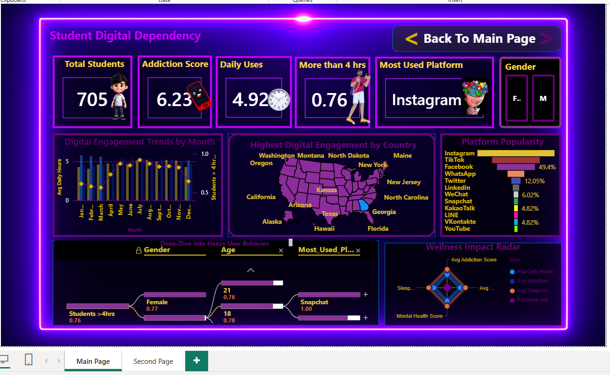
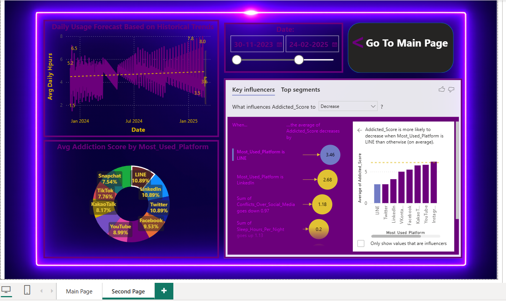

<!-- <h1 align="center">📊 Social Media Addiction Analytics Dashboard</h1> -->

<h1 align="center">
  📊 Social Media Addiction Analytics Dashboard
  
</h1>

<p align="center">
An interactive <b>Power BI Dashboard</b> that transforms raw student data into meaningful insights by analyzing social media addiction patterns, screen time, sleep quality, mental health, and academic performance.
</p>

<p align="center">


</p>

<p align="center">

</p>

<p align="center">
<i>📈 Analyze • 📊 Visualize • 💡 Discover Insights • 🎯 Make Better Decisions</i>
</p>

---

# 📖 About the Project

Social media addiction has become one of the fastest-growing digital challenges, significantly affecting students' **sleep quality, mental health, productivity, and academic performance**.

This project presents an end-to-end **Business Intelligence Dashboard** built using **Microsoft Power BI** to analyze **700+ student records**.

Using **Power Query**, **DAX**, and interactive Power BI visualizations, the dashboard converts raw data into meaningful insights that help understand behavioral patterns and identify the major factors influencing social media addiction.

---

# 🎯 Objectives

- Analyze social media addiction among students.
- Understand the relationship between screen time and sleep quality.
- Study the impact of social media usage on academic performance.
- Identify mental health indicators associated with digital addiction.
- Build an interactive dashboard for data-driven decision-making.
- Transform raw data into meaningful business insights.

---

# 🛠 Tech Stack

| Category | Technology |
|-----------|------------|
| Dashboard Tool | Microsoft Power BI |
| Data Cleaning | Power Query |
| Calculations | DAX |
| Dataset | Microsoft Excel |
| Data Modeling | Power BI |
| Visualization | KPI Cards, Charts, AI Visuals |

---

# 📂 Dataset Information

| Property | Details |
|----------|---------|
| 📁 Dataset Name | Social Media Addiction |
| 🌐 Source | Kaggle |
| 👥 Records | 700+ Students |
| 📊 Features | 14 Columns |
| 📄 Format | Excel (.xlsx) |
| 🎯 Domain | Social Media Analytics |
| 📈 Dashboard Tool | Microsoft Power BI |

### Dataset Attributes

- Age
- Gender
- Daily Usage Hours
- Weekend Usage Hours
- Time Spent on Social Media
- Gaming Hours
- Educational Usage
- Sleep Hours
- Anxiety Level
- Depression Level
- Academic Performance
- Addiction Level
- Date

---

# 🧹 Data Preprocessing

Before building the dashboard, the dataset was cleaned and transformed using **Power Query**.

The preprocessing workflow included:

- ✅ Removing unnecessary columns
- ✅ Handling missing values
- ✅ Correcting inconsistent data
- ✅ Formatting data types
- ✅ Creating calculated columns
- ✅ Creating Age Groups
- ✅ Creating Addiction Categories
- ✅ Creating Sleep Quality Categories
- ✅ Preparing the dataset for visualization

---

# 📊 Dashboard Features

The dashboard contains multiple interactive visualizations designed for exploratory analysis.

| Feature | Description |
|----------|-------------|
| 📌 KPI Cards | Display key performance indicators |
| 📊 Column Charts | Compare addiction across categories |
| 🍩 Donut Charts | Percentage distribution analysis |
| 📈 Line Charts | Trend analysis |
| 🌳 Decomposition Tree | Multi-level root cause analysis |
| 🤖 Key Influencers | AI-powered factor identification |
| 🎛 Interactive Slicers | Dynamic dashboard filtering |
| 📅 Timeline | Date-wise analysis |
| 🔍 Drill Through | Detailed exploration |
| 🔄 Cross Filtering | Interactive visual relationships |

---

# 🖼 Dashboard Preview

## 📊 Main Dashboard

<p align="center">

</p>

---

## 📈 Insights Dashboard

<p align="center">

</p>

---

# ⚙️ Power BI Components Used

### 📊 Data Modeling

- Relationships
- Data Types
- Data Cleaning
- Calculated Columns

### ⚡ DAX

- Calculated Measures
- Aggregations
- KPI Calculations
- Conditional Logic

### 🔄 Power Query

- Data Cleaning
- Data Transformation
- Missing Value Handling
- Data Formatting

### 🤖 AI Visuals

- Key Influencers
- Decomposition Tree

---

# 📈 Key Insights

The dashboard uncovered several meaningful patterns from the dataset:

### 📱 Social Media Usage
- Students with higher daily usage hours tend to have higher addiction levels.
- Weekend usage is significantly higher than weekday usage for most students.
- Social media consumption increases with overall screen time.

### 😴 Sleep Analysis
- Reduced sleep duration is strongly associated with excessive social media usage.
- Students sleeping fewer hours generally fall into Moderate or High addiction categories.

### 🧠 Mental Health
- Higher addiction levels are associated with increased anxiety and depression scores.
- Students with balanced screen time reported better mental well-being.

### 🎓 Academic Performance
- Academic performance decreases as addiction levels increase.
- Students with controlled social media usage generally maintain higher academic scores.

### 🤖 AI Insights
Power BI's **Key Influencers** visual identified:

- Screen Time
- Sleep Hours
- Social Media Usage

as the strongest factors influencing addiction levels.

---

# 📊 Business Impact

Although this project focuses on student behavior, the same Business Intelligence workflow can be applied in:

- 🎓 Educational Institutions
- 🏥 Healthcare Analytics
- 👨‍👩‍👧 Parent Monitoring Systems
- 📱 Digital Well-being Applications
- 📈 Behavioral Analytics
- 📊 Government Awareness Programs

The dashboard enables stakeholders to make **data-driven decisions** by identifying behavioral trends instead of relying on assumptions.

---

# 💼 Skills Demonstrated

This project demonstrates practical experience in:

- Data Cleaning
- Data Transformation
- Business Intelligence
- Dashboard Storytelling
- Data Visualization
- Power BI
- DAX
- Power Query
- Data Modeling
- Analytical Thinking
- Interactive Reporting
- KPI Design
- AI Visuals
- Problem Solving

---

# 🧠 Learning Outcomes

During this project, I strengthened my understanding of:

- Power BI Dashboard Development
- Data Modeling
- Power Query ETL
- DAX Measures
- KPI Design
- Dashboard Storytelling
- Business Intelligence Concepts
- Interactive Report Design
- Data Analysis Workflow

---

# ⭐ Why This Project?

This project was built to demonstrate how **Business Intelligence** can transform raw data into meaningful insights.

Instead of simply presenting charts, the dashboard focuses on uncovering relationships between social media usage, sleep quality, mental health, and academic performance through interactive analytics.

The project follows a complete analytics workflow—from data preprocessing and modeling to dashboard development and insight generation—making it a practical example of end-to-end data analysis.

---

# 📁 Repository Structure

```text
PowerBI-Social-Media-Analytics
│
├── Dashboard.pbix
├── Students_Social_Media_Addiction.xlsx
├── README.md
│
└── Images
      ├── img1.png
      └── img2.png
```

---

# 🚀 Getting Started

## Prerequisites

Before opening the project, make sure you have:

- Microsoft Power BI Desktop
- Microsoft Excel (optional)
- Windows 10/11

---

## ▶️ Running the Project

1. Clone this repository

```bash
git clone https://github.com/YOUR_USERNAME/PowerBI-Social-Media-Analytics.git
```

2. Open

```
Dashboard.pbix
```

using **Microsoft Power BI Desktop**.

3. If required, refresh the dataset.

4. Use the slicers and filters to interact with the dashboard.

---

# 📸 Dashboard Walkthrough

### Dashboard 1

- Overview of social media addiction
- KPI Cards
- Distribution Analysis
- Interactive Filters

---

### Dashboard 2

- Key Influencers
- Decomposition Tree
- Sleep Analysis
- Mental Health Analysis
- Academic Performance Analysis

---

# 📊 Dashboard Highlights

✔ Interactive Dashboard

✔ KPI Cards

✔ AI Visuals

✔ Dynamic Filtering

✔ Drill Down Analysis

✔ Cross Filtering

✔ Business Intelligence

✔ Dashboard Storytelling

✔ DAX Measures

✔ Power Query

---

# 📌 Project Highlights

✨ End-to-End Power BI Project

✨ Interactive Business Intelligence Dashboard

✨ AI-powered Insights using Key Influencers

✨ Data Cleaning using Power Query

✨ Custom DAX Calculations

✨ Dynamic Dashboard Design

✨ Business-focused Data Storytelling

✨ Professional Data Visualization

---

# 🤝 Contributing

Contributions, suggestions, and improvements are welcome.

Feel free to fork this repository and create a pull request.

---

# 📄 License

This project is created for educational and portfolio purposes.

Feel free to use it for learning and inspiration.

---

# 📬 Connect With Me

<p align="center">

<a href="https://github.com/VikashSingh81">

</a>

<a href="https://www.linkedin.com/in/vikashsingh89/">

</a>

</p>

---

# 👨‍💻 Author

## Vikash Kumar Singh

**B.Tech Computer Science & Engineering**

💡 Passionate about **Data Analytics**, **Business Intelligence**, **Power BI**, and **Data Science**.

Currently building end-to-end analytics projects that transform raw data into meaningful business insights through dashboards and visualization.

---

# ⭐ If You Like This Project

If you found this project helpful or interesting,

⭐ Star this repository

🍴 Fork it

💬 Share your feedback

---

# 🚀 Future Roadmap

- Add SQL integration
- Connect to live databases
- Publish dashboard to Power BI Service
- Add Row-Level Security (RLS)
- Enable scheduled data refresh
- Integrate predictive analytics using Python

---

# 🙏 Acknowledgements

- Microsoft Power BI
- Microsoft Learn
- Kaggle
- Open-source Data Analytics Community

---

<p align="center">

<h3 align="center">⭐ Thank You for Visiting ⭐</h3>

<p align="center">
If you found this project interesting, consider giving it a ⭐.
</p>

<p align="center">
I'm actively seeking opportunities as a <b>Data Analyst</b>, <b>Business Analyst</b>, <b>Business Intelligence (BI) Developer</b>, or <b>Data Science Intern</b>. If my work aligns with your team's requirements, I'd be happy to connect and discuss potential opportunities.
</p>

<p align="center">
<b>Let's connect and build data-driven solutions together! 🚀</b>
</p>

</p>
